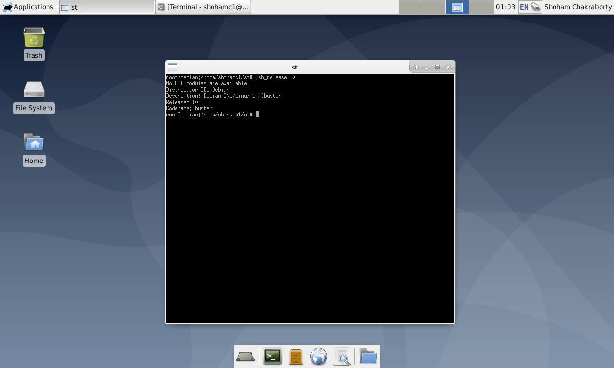
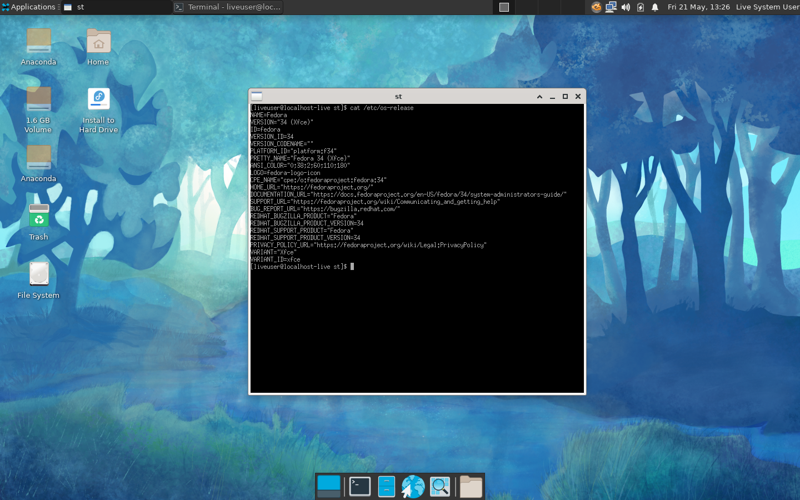

# st - Stupid Terminal

My attempt at creating a X11 terminal emulator.
[Inspired by this blog post.](https://www.uninformativ.de/blog/postings/2018-02-24/0/POSTING-en.html)

|            Debian             |            Fedora             |
| :---------------------------: | :---------------------------: |
|  |  |

## How to run

### Install Prerequisites

To build the project, you will need the X11 development headers.

Debian: `sudo apt install libx11-dev`

### Build and Run

These commands should build and run the terminal emulator.

```bash
git clone https://www.github.com/shohamc1/st.git
cd st
make clean install
```

Other `make` commands
|Objective | Command |
| --- | --- |
| build executable | `make build` |
| run executable | `make run` |
| clean files | `make clean` |
